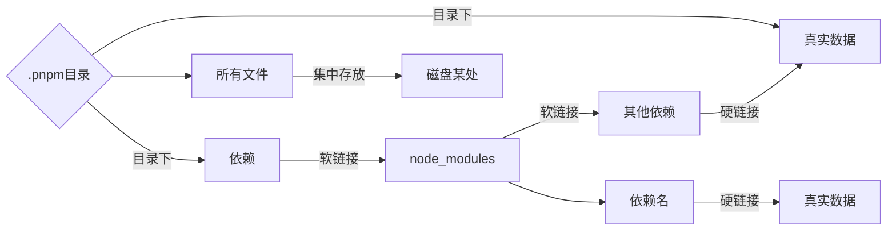

# Node.js的学习

## 安装

[前往nodejs中文网](https://nodejs.cn/)

<u>然后打开安装程序直接安装。</u>

> 在VScode终端使用node

右键文件夹然后选择 `在终端中打开`


**然后重启VScode**

## 基础操作

输出命令：使用 `node js文件路径` 运行js文件

node全局对象 `process.argv` ：一个数组。

- 索引1为【node程序路径】
- 索引2为【该js文件路径】
- 后续为输出命令添加的参数

额外参数 ：在输出命令后面可以加上 `num1=1` 这种字符串，将添加在全局对象 `process ` 的argv属性中。

******

*`console.clear()` 翻页，把终端命令置于前面。*

清屏命令：`cls`

## 全局对象

node中没有 `window` 对象，node中对应的是 `global` 对象

## 模块化开发

模块是指程序的部分结构，每个结构有独立作用域。独立结构的成员可以设为私有，或者提供给其他模块。

立即执行函数可以解决不同js文件带来的命名冲突，因为函数是独立作用域。

> Node

在Node中每个js文件是单独的模块，没有其他文件的访问权限。但是Node实现了模块化。

> 导入导出

导出：对象 `exports` ，此对象会被导出，所以可以把需要暴露的内容添加进此对象。

导入：函数 `require('filepath')` 返回值是该路径(可以省略.js后辍)文件所导出的对象。可以使用解构.

 若想修改已导出的值，必须修改exports对象，否则无效。

****

以上的导入/导出方式在开发中基本不用。

`module.exports = exports` 因此它们是同一个对象。一般是按照 `module.exports = {}`

## ESmodule

采用ESModule时，默认开启了严格模式。

**注意：**

- **Node使用的是CommenJS，所以无法使用ESmodule，但是webpack把这两个规范都实现了**
- **ESmodule必须在浏览器引用所有模块，因为运行环境是浏览器，无法自动运行所有模块。**

模块定义：在 `script` 标签加上标准属性 `type='module'` ，则形成作用域。

*****

导出：使用关键字 `export` 用 {}包裹导出内容，导出对象以 `，` 分隔。如 `export{a,b,c}`

别名：`as` 关键字在导出对象时使用别名如——`export {a as A}`

修饰符：在变量/函数定义时添加修饰符 `export` ，则自动导出该对象。

*********

导入：使用关键字 `import` ，`用法  import {导入内容} from 文件路径` ，如 `import{a} from './p.js'`

别名：导入也可以使用别名

导入整个模块：`import * as 模块名  from 模块路径` ，使用方式：模块名.导出内容

统一导入导出：在一个单独的js文件导入若干模块再导出。优化写法：`export ... from ...`

*****

默认导入导出：

默认导出：export default funcname /export default function () {};//默认导出只能有一个

默认导入：import foo from './a.js' //可以随意导入内容的标识名

*****

import() :import函数可以在代码中导入内容，参数为路径，返回值为Promise。可以解决import关键字导入只能在代码顶部的弊端。

## NPM包管理工具

可以使用 npm install命令下载js库，然后参考js库说明进行引用。

npm install 可以简写为 **npm i**

**配置文件与生成：**

npm install安装后会生成一个包文件 `./package.json` ,这个是项目的配置文件。

也可以用 `npm init` 命令来手动生成配置文件。`npm init -y` 直接生成默认配置文件。

**配置文件 的字段：**

* main:项目入口文件
* scripts:{
  * 脚本名：实际命令
* dependecies:依赖，对象格式（libname:version）
* devDependecies:开发依赖，开发时使用但项目不依赖的包
* peerDependecies:包依赖，依赖的包需要依赖另一个宿主包

配置了 `scripts` 字段后，即可使用 `npm run 脚本名` 执行实际命令。

配置了 `dependecies` 字段后，即可使用 `npm install` 自动安装配置文件的依赖。

配置了 `version` 字段，`^` 代表.y.z版本的最新，`~` 代表z版本的最新。

****

全局安装：加上 `-g` 进行全局安装，一般是安装开发工具包，有配置环境变量。

NPX：命令行执行命令时，默认从全局开始查找，使用了 `npx` 命令则从目录开始查找。

登录仓库：`npm login` 登录仓库，进行对仓库的更新

发布： `npm publish` 发布当前项目

## PNPM

官网：[pnpm](http://pnpm.io/zh)

> 硬链接与软链接
>
> - 硬链接：文件与硬盘数据之间的链接，可以多个文件与磁盘某处数据进行硬链接，修改这些数据都会直接修改磁盘的数据。
> - 软链接：软链接文件会连接一个文件，软链接文件只能当作路标去寻找被链接文件。

pnpm安装依赖只会保存一份真实数据，所有项目都会硬链接**同一个文件**，<u>不同版本的依赖</u>都会保存一份数据。

*****

> 扁平化：
>
> 扁平化是指按文件结构，展开目录的形式。

PNPM采用的则是非扁平化的设计，所有的依赖包都在**顶层**展示。

依赖包的文件夹是一个**软链接**，它链接一个**node_modules**。包其他依赖软链接到.pnpm目录的（硬链接）文件夹。


使用：

`npm i pnpm -g` 全局安装pnpm

`pnpm init` : 直接初始化一个配置文件

`pnpm i` ：安装配置文件依赖

`pnpm add` : 安装依赖

`pnpm remove` ：卸载依赖


## webpack

> 写项目时需要使用很多框架，项目写好后并不能直接运行，因为项目是特殊规范所以浏览器无法识别，需要使用webpack进行打包（转换规范）使浏览器可以识别，再部署到服务器。

### 命令：

`webpack` ：打包项目

`webpack --entry path` ：指定打包文件路径

`webpack --entry path --output-filename name ` :指定打包路径及输出文件名

`webpack --entry path --output-path path ` :指定打包路径及输出文件路径

### 配置文件：

`./webpack.config.js`  或者 `--config 自定义配置文件` 

配置文件需要使用导出：

```javascript
const p = require('path')
const abpath = p.resolve
module.exports = {
  entry:abpath('./src/main.js'),
  output:{//输出相关的
    filename:'Main.js',
    path:abpath('./output/')
  }
}
```

webpack `--` 的字段表示导出一个对象。`-` 的字段表示一个属性（路径属性的值必须为绝对路径）。

也可以不创建webpack配置文件，配置npm的***scripts***也一样。

### 引用css：

> 通常编写的css样式不会被打包，所以需要加入进依赖结构

在一个模板中 使用 `import 'path'` 引入该css，因此html引用该模板，打包后css也会被引用。

*<u>但是在没有使用 `loader` 时，webpack还不能**识别** **css** 进行打包。</u>*

******

安装: `pnpm add -D css-loader style-loader `

在配置文件里新建字段module：

```javascript
module:{
  rules:
  [
    {
      test:/\.css$/,
      use:[{loader:'style-loader'},{loader:'css-loader'}]
      // ,use['style-loader','css-loader']   
    }
  ]
}
```

> less的加载：

安装:  `pnpm add -D less-loader `

push一个rule对象 `test:/\.less$/, use['style-loader','css-loader','less-loader']` ，从右往左解析

### 引用图片和字体：

import导入图片/字体时，返回**路径字符串**

push rule对象：**{test: 匹配后缀名正则,type: 'asset/resource',generator.filename:'[name]\[ext]'}**

配置完规则后，打包时，资源会导出到 `output.path` 目录，也可以设置filename加上相对路径

导出命名可以使用占位符：**[name]源文件名、[ext]源后缀名、[hash:len]哈希**

### babel:

babel是用于转换ES6及之后版本的JS转换为向后兼容的JS

安装babel-loader：**npm i babel-loader -D**

配置rule，//plugins中的插件均需安装

```javascript
{
  test:/\.js$/,
  use:{
    loader:'babel-loader',
    options:{
      plugins:['plugin1','plugin2']
    }
  }
}
```

options对象也可以抽取到**./babel.config.js** ，即 

```javascript
//babel.config.js
module.exports = {
  plugins:['plugin1','plugin2'],
}
```

一般情况babel不会安装插件，而是直接安装一个预设：**npm i @babel/preset-env -D**,再调整配置为

```javascript
//babel.config.js
module.exports = {
  plugins:['plugin1','plugin2'],
  presets:['@babe/preset-env']
}
```

### 路径名：

- **文件后缀：**webpack识别文件，是按resolve.extensions[]来追加后缀名的，可以在该数组中加入若干格式。
- **路径别名**：webpack还可以给绝对路径起别名，是按resolve.alias.name = 'abpath'，在后来name即代表abpath，也可以在name后加上$表示精确解析，即这个别名表示完整路径不额外拼接，如果拼接则只作普通路径。
- **模块查找**：webpack识别模块，因为在路径中找不到，则去node_modules查找，所以不需要路径和后缀名。

### plugin：

以 `clean-webpack-plugin` 为例

先安装该插件，然后导入它: const {CleanWebpackPlugin} = ...

在配置文件新建字段plugin[]，然后push插件的实例 **new CleanWebpackPlugin()**

**该插件将自动清理output.path路径**

****

`html-webpack-plugin`

安装插件，然后require()得到类，再把实例push到plugin[]。

这个类支持传入一个对象，{title='aaa'，template='html'} 这样就能给html设置标题,和模板html

**该插件以ejs模板生成html自动引用js**

****

`DefinePlugin`

**webpack已内置，DefinePlugin({})定义一个webpack的全局变量a，可以在html，css，js中使用。**

### webpack serve：

安装：npm i webpack-dev-server -D

配置：devServer.static ，这个字段记录server监测的目录。

启用serve:`webpack serve --open` 

***tips：最好把服务启动命令配置到package.json。***

webpack serve 自动开启一个服务，在内存中会加载项目，然后在某个端口监听，**自动检测代码的更新**并刷新。

热更新：使用热更新的模块，可以在编辑代码时不刷新网页，而直接替换脚本更新后的操作。

> 开启热更新：
>
> 配置：devServer.hot，这个字段为热更新的布尔值，默认已配置
> module.hot.accept(path,callback):该函数可以设置热更新，path为热更新文件，callback回调

### mode：

webpack配置文件有个 `mode` 参数，可以设置三种值：

1. none
2. develoment
3. production

后两个分别是：开发环境和生产环境

开发环境和生产环境一般不作区分，但是可以手动配置，也就是做成三个webpack文件。

即：公共配置，开发配置，生产配置

> webpack-merge
>
> 安装：npm i webpack-merge -D
>
> 使用CommonJS引用：const {merge} = require('webpack-merge')
>
> merge函数，merge函数可以将两个webpack.conf合并，也就是最终返回给exports，可以用这个函数来设置多个配置文件

# Git的学习

`git add .` ：提交文件到缓存区, `.` ：全部（文件）

`git commit -m ''` ：提交缓存区文件到仓库，`-m`: 描述

`clear` ：清屏

`git init` ：初始化一个本地仓库

`git clone url` ：克隆一个远程仓库

`git status -s` ：状态，显示未追踪，已追踪，可提交，修改过的文件，`-s`: 简述

`git log` ：进入vim查看日志信息（提交的条目）

`git commit -a` ：添加到暂缓区并提交到仓库

`git reflog` ：查看提交——带七位校验和

`git reset --hard HEAD^ ` ：回滚Head指针提交。`Head`是提交列表最顶部的条目，也就是上次提交。`HEAD^` :上上次提交。`HEAD^9` ：第九次提交。`--hard 校验和` ——某次提交。

`git fetch` ：从远程获得仓库

`git merge`：合并到当前分支

`git pull `  ：从远程获得仓库后合并分支,

`remote add [alias] [url]` ：远程版本库添加

`git remote -v` ：查看当前版本库

`git push [alias] [branch]`：push提交到仓库。alias：版本库，branch：分支

*****

**忽略文件**：把不需要跟踪的文件名加入 `.gitignore` ，以行分隔。可以去github开源的gitignore仓库找到对应的模板，这样就能配置适合自己忽略文件。

**密钥生成**：生成公钥和私钥一对，公钥配置在远程，私钥与远程的公钥配对完成连接	

```bash
ssh-keygen - t rsa -C email
```

**分支详解：**分支合并时，需要**指定远程仓库的具体分支**，与本地的当前分支合并。

- **先fetch版本库**，然后git branch --set-upstream-to=[alias]/[branch] 设置**上游分支**，由此实现分支跟踪。
- git2.9后不能合并没有**公共结构的分支**，需要merge命令带参数 `--allow-unrelated-histories`

**克隆：**git clone与git fetch不同，clone直接进行追踪，由于不初始化仓库所以**本地即远程**，不存在两边的分支。

**git push默认行为**：git push是一个简短的命令，不携带参数，相当于提交当前分支到远程分支**（远程无该分支则失败）**，可以通过以下命令更改它的默认行为。

```bash
git config push default ↓↓↓默认行为↓↓↓
```

- simple：默认的，当前分支（**远程无该分支则失败）**
- upstream:上游分支
- current：当前分支**（远程无该分支时则新建）**

​	

