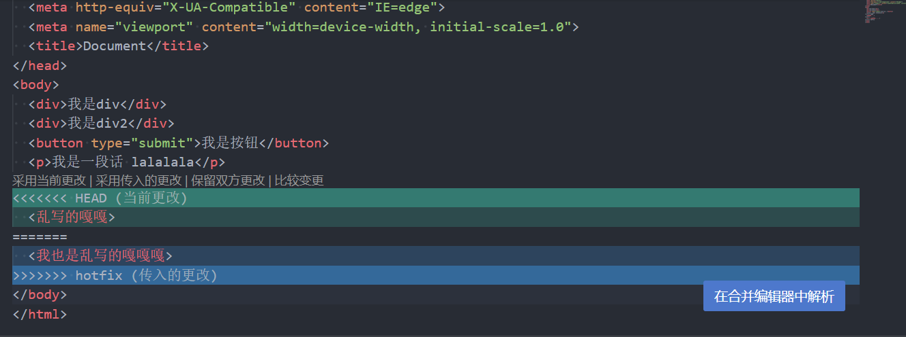
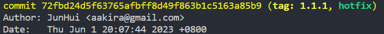
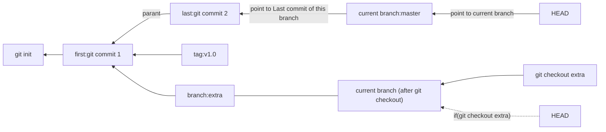

# Git的学习

`git add .` ：提交文件到缓存区, `.` ：全部（文件）

`git commit -m ''` ：提交缓存区文件到仓库，`-m`: 描述

`clear` ：清屏

`git init` ：初始化一个本地仓库

`git clone url` ：克隆一个远程仓库

`git status -s` ：状态，显示未追踪，已追踪，可提交，修改过的文件，`-s`: 简述

`git log` ：进入vim查看日志信息（提交的条目）

`git commit -a` ：添加到暂缓区并提交到仓库

`git reflog` ：查看提交——带七位校验和

`git reset --hard HEAD^ ` ：回滚Head指针提交。`Head`是提交列表最顶部的条目，也就是上次提交。`HEAD^` :上上次提交。`HEAD^9` ：第九次提交。`--hard 校验和` ——某次提交。

`git fetch` ：从远程获得仓库

`git merge`：合并到当前分支

`git pull `  ：从远程获得仓库后合并分支,

`git checkout [branch tag]` ：跳转到分支/标签，（检查本地有没有分支，没有就设立上游分支，并创建本地分支）

`remote add [alias] [url]` ：远程版本库添加

`git remote -v` ：查看当前版本库

`git push [alias] [branch]`：push提交到仓库。alias：版本库，branch：分支

`git tag -a version -m annot` ：给本次提交加上tag。-a：带注解，-m：注解信息，**-d：** 删除该tag

`git rebase` ：合并分支到当前分支，并且不新建commit对象。

*****

**忽略文件**：把不需要跟踪的文件名加入 `.gitignore` ，以行分隔。可以去github开源的gitignore仓库找到对应的模板，这样就能配置适合自己忽略文件。

**密钥生成**：生成公钥和私钥一对，公钥配置在远程，私钥与远程的公钥配对完成连接	

```bash
ssh-keygen - t rsa -C email
```

**分支详解：**分支合并时，需要**指定远程仓库的具体分支**，与本地的当前分支合并。

- **先fetch版本库**，然后git branch --set-upstream-to=[alias]/[branch] 设置**上游分支**，由此实现分支跟踪。
- git2.9后不能合并没有**公共结构的分支**，需要merge命令带参数 `--allow-unrelated-histories`

**克隆：**git clone与git fetch不同，clone直接进行追踪，由于不初始化仓库所以**本地即远程**，不存在两边的分支。

**git push默认行为**：git push是一个简短的命令，不携带参数，相当于提交当前分支到远程分支 **（远程无该分支则失败）**，可以通过以下命令更改它的默认行为。

```bash
git config push default ↓↓↓默认行为↓↓↓
```

- simple：默认的，当前分支 （**远程无该分支则失败）** 
- upstream:上游分支
- current：当前分支 **（远程无该分支时则新建） **

**标签：** 标签可以理解为当前项目的某个版本，一般项目有了大的变动，实现了很多新功能或者优化了性能、修复bug等等，可以为当前项目更换为一个版本（tag），也就是commit后使用git tag，最后用git push [alias] [version]来同步到远程仓库，或者git push [alias] --tag同步本地所有tag

**bug修复：** 如果有人在项目的某个tag发现了bug，那么需要切换到该tag版本，然后创建一个分支用于修复bug，该分支常用名 `hotfix` ，修复好之后要更新该tag的z号（比如1.0.0 --> 1.0.1）。最后就是把hotfix分支合并到项目最新分支。

```bash
#当前你正在main分支开发项目
git commit -a -m '刚刚开发了点东西'
#此时有人报告了你项目1.1.0版本的bug
#于是你切换该版本
git checkout 1.1.0
#并且建立了修复的工作流
git checkout -b hotfix
#你快马加鞭修复了bug，并且更新了项目的z版本
git commit -a -m 'Bug fix completed'
git tag 1.1.1
#你切换回了main分支，然后进行合并
git checkout main
git merge hotfix
#但是出现了冲突，把冲突代码调整后，问题终于得到了解决。
```

**合并冲突：** 如上合并时出现冲突，`<<<HEAD 源分支冲突的内容	===`   `=== 合并冲突的内容	>>>merge branch` 。



合并结束当前分支 `parent` 指向**上一个分支和合并的分支**


